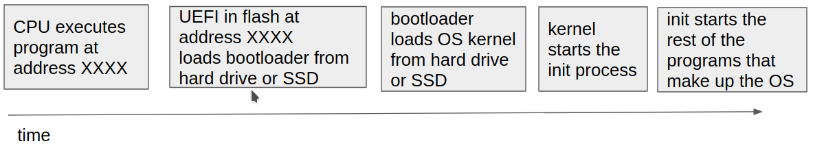
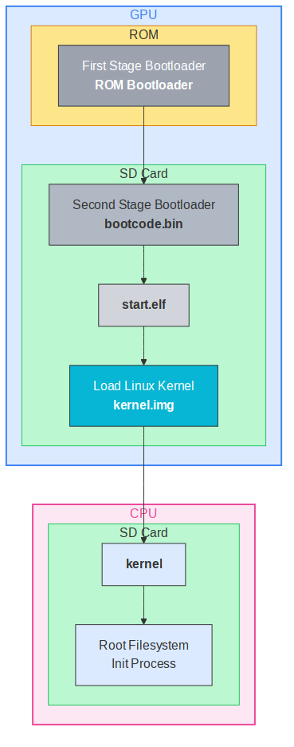

**Student:** Hi Professor, I am taking your operating systems class this semester.

**Professor:** Welcome! You can just call me Ben. This is my favorite class to teach. Operating systems are where our code runs. Understanding that environment can allow you to do some magical things.

**Student:** What is this chapter? I thought you said the book is amazing. Why do we need more?

**Professor:** The book is amazing! (And free which is also amazing!) I noticed that the book was missing a description of how operation systems start and a high level view of the architecture. It also assumes that students have a good idea of what kernel-mode and user-mode is.

**Student:** So, what is an operating system?

**Professor:** Oh, that is a great question! Different people have different definitions of what an operating system is. Let's come back to that question after you have read this chapter.

**Student:** Uh, okay... Well, what will I learn in this class.

**Professor:** Another great question! I guess that is really up to you. I'll introduce you to some ideas in lecture. We are using a great book. And, I have some great programming assignments to make sure that you have mastered the concepts we covered. Oh, I guess the exams will also help make sure you've mastered the concepts. In the end though, what you learn depends on you.

**Student:** Hmm, I see. Okay. Well, one last question: when will Professor Arpaci-Dusseau be back?

**Professor:** Next chapter.

**Student:** Good!

\newpage

# Introduction

There are many ways to start talking about operating systems.
You can cover what they do and how they work; that is the focus of most of the book.
You can give a history of operating systems; you will find that introduction in the next chapter.
This chapter introduces operating systems by describing how they start when power is applied to a computer system.
We call this initial startup process *boot up* and say that the computer is *booting*.
Note, this is a book for computer scientists; electrical engineers and system designers will rightfully point out that there is much more choreography happening with the electronics than is being described here.
Further, this is a high-level description of the process of booting.
Everything we discuss in this chapter has associated caveats and nuances that are ignored in order to provide a concise presentation.
Hopefully, by the end of this chapter, you will begin to form an idea of what an operating system is so that as you learn the concepts in this book and the caveats and nuances that have been elided, you will have the needed context to understand them.

## Genesis

A processor processes instructions.
It continually reads instructions from memory and executes them.
What does a processor do when a machine powers on?
There is nothing in RAM when the power is switched on, so what can it execute?

Figure 1 shows a timeline of the different programs involved in booting an operating system.

When a processor is powered on, it knows to do one thing: start executing instructions found at predefined address.
How it does that varies between processors.
It seems natural to start executing code at address `0x00000000`, but that is not the normal initial jump address for popular CPUs.
The x86_64 CPUs, found in most PCs, start executing at the address `0xFFFFFFF0` [@intel:asdm].
ARM based processors, found in most phones and new Apple products, boot from the address `0x00000000` or `0xFFFF0000` depending on a hardware configuration [@arm].
As with x86_64 CPU systems this address is usually found in ROM.
However, we will see a variation of this in the Raspberry Pi section below.
Even Intel based Macs have a slightly different boot process [@macboot].

### BIOS and UEFI

Usually, there is flash memory, also referred to as *firmware* at that address containing the initial program.
For systems dedicated to a simple application, that initial program may be the application itself.
For general systems, manufacturers want more flexibility.
They want to provide an option to choose alternate storage devices to boot from or perhaps run diagnostics.
To get this flexibility, they use a *layer of indirection*.
Rather than running the program they want directly, they load a program that knows how to load other programs.
This technique of introducing a layer of indirection is a reoccurring theme in operating systems and programming in general.
It is one of the two common answers to computer science problems.

Historically, this first program that is run is called *BIOS* (Basic Input/Output System) in PCs, but newer computers use *UEFI* (Unified Extensible Firmware Interface).
The UEFI program is assembled by the system manufacturer and installed in the motherboard's flash by the manufacturer when the computer is built.
UEFI discovers and initializes devices that make up the computer.
It generates the splash screen that usually shows the manufacturer's name and logo.
There is usually a key combination that you can press to access the configuration menu of the UEFI to configure boot devices or tweak system parameters.

::: {.tip}
**Tip:** The two solutions to all computer science problems

There are two techniques that are so common to computer science solutions that it is worth pointing them out explicitly:

- Caching: storing results to reuse in the future to improve performance.
- Level of indirection: adding a layer of access to an object for flexibility and efficiency.

An often quoted corollary to the level of indirection is "except for the problem of too many layers of indirection", which can be solved by caching.
Note that these techniques also give rise to the two hard problems in computer science:

- Cache invalidation.
- Naming.
- Off-by-one errors.

As you go through this book you will see multiple examples of these solutions and problems.
The interaction is especially evident when we look at page tables and TLBs.
:::

### Bootloader

UEFI initializes system devices and finds the next program to start.
You might expect that the next program would be the operating system, but that is not usually the case.
While the indirection provided by UEFI allows the manufacturer of the computer to provide some flexibility at startup, operating system vendors would also like flexibility as well.
Sometimes, operating systems have "safe mode"s that allow the system to boot with just basic functionality, for example.
For this reason, UEFI usually loads a *bootloader* that knows how to load the operating system.

The bootloader is generally written by the operating system provider (Microsoft, Apple, or open source developers).
The manufacturer may pre-install the bootloader on the computer storage or it may be installed by the user.
The bootloader's main job is to get the operating system kernel loaded and running.

### Raspberry Pi

{ width=30% }

There is an interesting variation to the above boot sequence that is found in the Raspberry Pi, which is popular in embedded applications.
Figure 2 shows a flow similar to the one that we just discussed except that the first processor involved is the GPU (Graphical Processing Unit) rather than the CPU, which is an ARM processor on the Pi.
Today's GPUs are used for more than just rendering graphics and the Pi takes that to an extreme.
When the Pi powers on, it is the GPU that powers up rather than the CPU.
The GPU boots from ROM where it finds a first stage bootloader.
On many Pis the ROM cannot be updated, so this first stage bootloader's sole job is to load the second stage bootloader from the storage (network loading is also supported).
This second stage bootloader initializes the hardware and loads the kernel into RAM at which point the CPU is powered on and starts executing the kernel.

Even though the boot sequence uses the GPU rather than the CPU to load the kernel, we see the same common theme of using layers of indirection to provide flexibility in the boot process.

## The kernel

The program usually loaded by a bootloader is the operating system *kernel*.
We call it the kernel because it is the central part of the operating system.
The kernel is the first part of the operating system to start and gets everything else going.
The bootloader loads the kernel into memory and finishes by starting the kernel.

Even though the kernel is an executable program we normally do not refer to it as a program.
When it starts, the kernel will do its own discovery and initialization of system devices and resources.
Once everything has been initialized, the kernel will start the first process.

At first glance it appears that we are continuing the chain of using one program to load another, but in the case of the kernel, things happen differently.
First, the kernel does not go away[^1].
It remains loaded in memory and will respond to system events such as device interrupts (key presses, mouse movements, packets arriving, etc).
Second, the processes started by the kernel do not have full control of the CPU.
They run in a lesser privileged mode called *user-mode*.
In user-mode, running programs (called *processes*) are not able to access some of the more powerful instructions and registers, but with those exceptions when they run, they have full control of the CPU.

### init

At this point things flow differently based on the operating system that is starting up.
Because this book takes the UNIX perspective on operating systems, we will discuss Linux, currently the most popular Unix-like operating system in use today.

Unix-like kernels start a first process called `init`.
Each process in the system is assigned a number, and `init` is appropriately assigned the number 1[^2].
This process is in charge of starting up the rest of the programs that the system needs.

Sometimes `init` is as simple as a script that starts up a list of other programs and never terminates, but usually `init` is a more sophisticated program that manages program dependencies.
Systemd is currently a commonly used `init` program in Linux systems.
For example, before we start a webserver, we want to have the network configured.
This means that the network configuration scripts and programs must be started before the webserver is started.
On a desktop system, eventually the graphical environment will start (either Xwindows or Wayland) and then the login UI will start.

The `init` process will continue running and monitoring the programs it has started.
Often times, the `init` process will be expected to restart programs if they fail.
If the `init` process ever finishes, the system will crash.

### System calls

{ width=50% }

During system startup and even normal execution processes will need to do powerful operations that they cannot do in user-mode.
Some examples of these kinds of operations are: give or remove physical memory, create new processes, end processes, access hardware devices, etc.
Fortunately, the kernel, which runs in *kernel-mode*, can do all those things.

A process asks the kernel to do things on its behalf using *system calls*.
Software interrupts or special system call instructions[^3] allow a process to transfer control to the kernel and switch into kernel-mode.
The kernel will look at the process making the request and decide if it is willing to perform the requested operation.
Once the operation is finished, the kernel will switch back into user-mode and transfer control back to the process.

User-mode allows processes to run in a safe environment that can make sure process failures and other errors do not affect each other.
Processes are isolated from each other because the kernel gives each process its own memory space.
The kernel also cleans up after processes when they fail or finish.

Figure 3 shows an example of an application, `myapp` invoking a system call to open a file.
When the call is invoked, the processor will switch to kernel mode and call the open file function in the kernel.
To open a file, the file system would need to read data from the storage device containing the file system, so it would need to invoke code in the storage device driver to read that data.
Since both the file system and device drivers are in the kernel, invoking the code and passing the data between the file system and device driver is as simple as calling a function and accessing results via registers and memory.
Returning results back to `myapp` requires data to be copied from kernel memory into the application's memory.
The processor also needs to switch back to user-mode when the system call returns.

### Commands

What about the commands we run? Are those part of the operating system?
For example, on Linux and OSX, we list the files in a directory using `ls`, but on Windows we use `dir`.
There are also commands like `find` to search files in the file system and `grep` to search the contents of files.
The command `xterm` creates a terminal, and the window manager commands start the graphical environments that we work in.

While these commands are often considered part of the operating system, and ship with the operating system, and are needed to make it useful, they are just programs running in userspace.
Some programs started off as separate projects and later made their way into operating system distributions.
For example, `zsh` the default shell on OSX was written by a student, Paul Falstad, at Princeton in 1990.
Hisham Muhammad developed `htop`, the popular replacement for `top`, just before starting his Master's at Pontificia Universidade Catolica do Rio de Janeiro.
These are just two examples of programs that people wrote that later became an important part of operating system distributions.

So, how does a program go from being just a program that someone writes, to something that you can run as a command?
It turns out that it is just a matter of where the program resides and the value of the `PATH` environment variable.
We usually think of a command as something that we can run by just typing its name.
For example, we type `ls` to list the files in a directory.
But, we can also type `/usr/bin/ls`.

The locations that the operating system looks for commands is governed by the `PATH` environment variable.
You can see the list of directories that it looks for commands by typing `echo "$PATH"`.
If you put a program you write into one of those directories, it will become a "command".

What if we think the operating system is missing a hello world command?
We write the classic one-liner in `hello.c` and compile it to `hello`.
If we copy it into `/usr/bin`, we can type `hello` anytime we want for a pleasant greeting.

In practice, you shouldn't put personal commands into `/usr/bin`.
Usually, we create a `bin` or `.local/bin` in our home directory to store our personal commands.
Often, your operating system distribution will have a default personal `bin` directory.
Run `echo "$PATH"` and look through the directories to see if you already have something set up.

## Micro kernels

Linux and most popular implementations of Unix-like operating systems have kernels that always run in kernel-mode.
These kernels behave like they are a single running program.
We call these kernels *monolithic kernels*.

*Micro kernels* provide an alternative way of implementing operating systems kernels.
Rather than implementing everything in a single kernel, micro kernels use separate services for things like device drivers, file systems, memory managers, etc.
These services run in user-space and thus are isolated from each other.
The kernel communicates with these services, and services communicate with each other, through Inter-Process Communication (IPC) mechanisms.
Simply put, they send messages to each other.

As you can imagine micro kernels can have quite a bit of overhead and introduce more complicated interactions.
For example, in a monolithic kernel, the file system driver can call a storage system driver through a function call.
Both drivers can access each others' memory, so the interaction really is as simple as a function call.

{ width=75% }

Figure 4 shows `myapp` invoking a system call to open a file in a microkernel.
In a microkernel, the file system is running outside the kernel but the kernel mediates the communication between `myapp`.
The kernel ensures that `myapp` and the file system are isolated from each other, but it also needs to secure and efficiently provide communication between the two endpoints.
A similar communication is needed between the file system and device driver.

All this sounds complicated, and it is!
There is quite a bit of overhead in the communication and switching between the processor modes.
The switching also involves more code and more memory accesses.
The "micro" in the name refers to the size of the small kernel mediating communication between the kernel services, but historically the end result, the micro-kernel and required kernel-services, is much bigger than an equivalent monolithic kernel.
With this extra overhead, what is the motivation for doing micro kernels?
Isolation.
The same isolation that introduces complexity also provides a level of safety.
If the storage system driver has a bug that causes memory corruption, it might crash and return corrupted data to the file system.
However, in a monolithic kernel, a buggy driver might corrupt memory in any part of the kernel and can crash the whole system.

Micro kernels have not taken off as expected a few decades ago, but they are still around.
New experimental operating systems often use a micro kernel architecture.
Even though Linux is a monolithic kernel, projects such a FUSE (File system in USEr-space) bring some aspects of user-space services to the kernel.

::: {.tip}
**Tip:** Linus Torvalds and Professor Tanenbaum

In 1992, there was an interesting debate (AKA flamewar) [@linux-ast] on a USENET (message board) channel about the first version of Linux.
At the time, Linus Torvalds was still an undergraduate at the University of Helsinki.
Professor Andrew Tanenbaum was (and still is) an accomplished professor of computer science who has written many books on operating systems and networking.

Linus had recently released the first version of Linux, and Professor Tanenbaum took issue with some of the design decisions.
Much of the criticism revolved around Linux being a monolithic kernel, even though it seemed evident that micro kernels were the future.
The debate branched into a variety of subjects around operating system design and the future evolution of hardware.

The debate is especially interesting with hindsight.
The debate shows how difficult it is to predict the future even with a deep understanding of current technology.
After all these years, Linux has come to be the most widely used, scalable, and portable operating system in history.
:::

## Summary: What is an operating system?

We will end this chapter with the question "What is an operating system?"
The question is more complicated and vague than it would seem.
Microsoft at the beginning of the "Browser war" in the late 1990s declared that the web browser was part of the operating system.
The competing browsers at the time were not part of the operating system and developers of those browsers, especially browsers that ran on multiple operating systems, considered the operating system to be the environment that they ran in.

When developers write applications for operating systems, there are frameworks from those operating systems that they use to build those applications.
A few examples of these frameworks are UI libraries, standard libraries for languages, and networking libraries.
However, developers of those libraries also use lower level services.
Even the standard C library, which is the lowest level library that applications use, is often adapted for different operating systems.

The point of this discussion is that different people have different definitions of the operating system.
It is natural that users of ChromeOS would consider the Chrome browser to be part of the operating system, Chrome browser developers are not generally considered operating system developers.

There is one thing that everyone agrees is the operating system: the kernel.
The kernel is central to all the core services that an operating system provides.
As you continue through this book, most of the time we will be focused on the functionality that the kernel provides and how to use that functionality.

As you go through this book you will learn important concepts that will help you use the services provided by the operating system.
You will also learn about the power and limitations of the abstractions provided by the operating system.
Hopefully, you will also come to understand how you can apply the techniques used by operating systems in your own applications.
Many of the techniques of scheduling, memory and storage management, and concurrency control are used in applications such as databases, schedulers for distributed systems, and distributed storage.
These are just a few of the many examples of applying operating system concepts to solve problems beyond a single operating system.

## References

::: {#refs}
:::

[^1]: There are parts of UEFI, BIOS, and other management systems that do stick around but they are outside the scope of this discussion and can be ignored for this discussion.
[^2]: Hmm, is it really appropriate to start at 1? Many programmers would say that the first number is 0 ;) There is that off-by-one again!
[^3]: Appropriately named SYSCALL on x86 and SVC on ARM.
